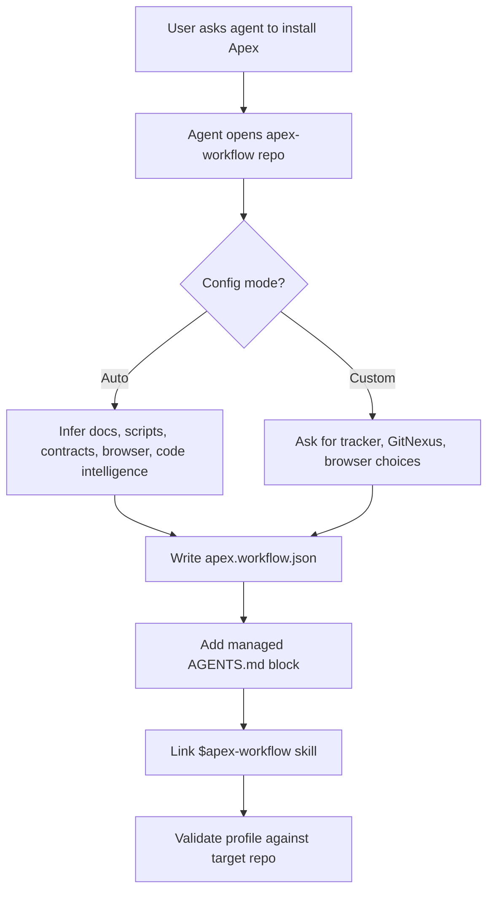
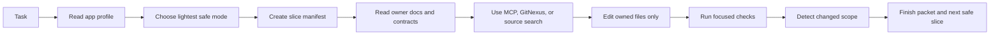

# Apex Workflow

Apex Workflow is a configurable harness for Codex and LLM coding agents that turns "work on this repo" into a disciplined loop: orient, choose scope, record a slice, route through contracts, verify, and hand off cleanly. It gives every app its own workflow profile, so an agent can adapt to your tracker, GitNexus/MCP setup, browser tooling, design rules, and test commands without hard-coding one company's process.

## What It Is

Apex is not another prompt dump. It is an installable repo harness that writes an `apex.workflow.json` profile into the target app, adds an agent-facing `AGENTS.md` block, installs the `$apex-workflow` skill, and gives future agents a manifest-driven way to do real engineering work without rediscovering the repo every session.

## The Point

Most coding agents fail in the same places:

- they search before they understand the repo's authority chain
- they edit shared code as if it were local code
- they lose track of what files belong to the current slice
- they claim broad verification from narrow evidence
- they create tracker noise or skip tracker state entirely
- they forget what happened when a session resumes

Apex makes those failure modes explicit and configurable.

## Install Flow



From this repo:

```bash
npm run init -- --target=/path/to/app --config-mode=auto --yes
```

For custom agent-driven setup:

```bash
npm run init -- \
  --target=/path/to/app \
  --config-mode=custom \
  --tracker=linear \
  --tracker-team="Team Name" \
  --tracker-project="Project Name" \
  --code-intelligence=gitnexus-mcp \
  --browser=agent-browser \
  --origin=http://127.0.0.1:3000 \
  --yes
```

## Execution Loop



The manifest is the spine. It records the issue/tracker disposition, mode, owned files, no-touch surfaces, contracts read, code-intelligence checks, browser expectation, verification commands, known failures, and the next safe slice.

## Why The Workflow Works

- **Profiles keep the workflow portable.** The generic skill stays clean; app-specific truth lives in `apex.workflow.json`.
- **Mode selection prevents ceremony creep.** Tiny fixes stay tiny, while shared surfaces trigger stronger routing and verification.
- **Slice manifests remove ambiguity.** The agent always has a current-slice file list, no-touch list, and finish packet.
- **Contracts beat vibes.** The agent reads feature/state docs before touching shared workflows.
- **Code intelligence is adapter-based.** GitNexus MCP is preferred, wrapper fallback is supported, and source search remains the final fallback.
- **Verification is scoped.** Focused checks come first; broad checks are used when the blast radius justifies them.
- **Tracker state stays honest.** Linear, GitHub, file trackers, or no tracker can be configured without turning the tracker into product truth.

## Tradeoffs

Pros:

- gives agents a repeatable install and execution path
- lowers resume ambiguity across long-running work
- makes shared-surface risk visible before edits
- keeps product truth, tracker state, code intelligence, and verification separate
- works with MCP-first GitNexus while preserving wrapper fallback for fragile local setups

Cons:

- requires an app profile before the workflow is useful
- adds one small manifest step for meaningful code slices
- cannot infer every product authority document perfectly on first install
- GitNexus still depends on the host agent's MCP/runtime health unless a wrapper fallback is configured
- teams need to keep their repo docs and tracker semantics honest for the harness to stay valuable

## Repository Contents

- `AGENTS.md`: instructions for agents installing this harness.
- `skills/apex-workflow/`: installable Codex skill.
- `templates/apex.workflow.json`: starter app profile.
- `profiles/minty.workflow.json`: first extracted real-world profile.
- `schemas/apex.workflow.schema.json`: profile schema.
- `scripts/init-harness.mjs`: target-repo installer.
- `scripts/apex-manifest.mjs`: slice manifest helper.
- `scripts/check-config.mjs`: profile validator.
- `docs/adoption.md`: setup details.
- `docs/extraction-map.md`: what was extracted and why.

## Local Checks

```bash
npm run check:config
npm run self-check
```

