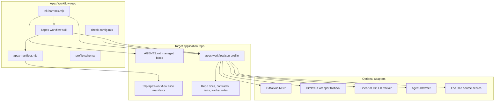
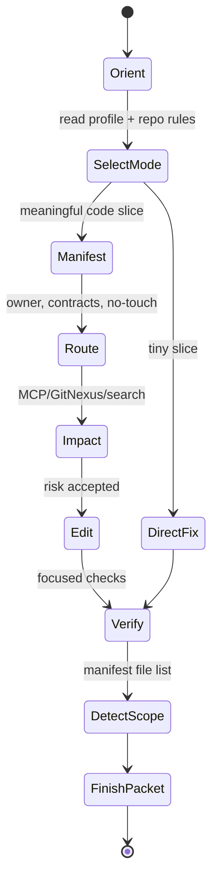

# Apex Workflow

> A repo-native control plane for Codex and LLM coding agents.
> Stop letting agents improvise your engineering process. Install a harness that forces orientation, scope control, contract routing, MCP/GitNexus impact checks, verification, and clean handoff state.


## The Short Version

Apex Workflow turns a repository into an agent-operable system: it installs an app-specific workflow profile, gives the agent a mode/state machine, and records every meaningful slice in a manifest before code gets touched. The result is less vague "I changed some files" automation and more controlled engineering: known authority docs, scoped ownership, explicit no-touch surfaces, code-intelligence checks, focused verification, and a next safe slice.

## Why This Exists

Most LLM coding agents do not fail because they cannot write code. They fail because they enter a repo with no operational discipline.

They search before reading the authority chain. They edit shared surfaces as if they were local helpers. They lose track of which files belong to the current slice. They treat screenshots as visual signoff. They skip tracker state or create junk tickets. Then the next session has to reconstruct the mess from a dirty tree and half-remembered chat.

Apex is the antidote: a portable workflow harness that makes the agent follow the repo's actual operating model.

## Architecture



## Execution State Machine



## Install

Ask the agent installing Apex one setup question:

```text
Auto-configure from repo evidence, or choose tracker/GitNexus/browser options?
```

Auto mode:

```bash
npm run init -- --target=/path/to/app --config-mode=auto --yes
```

Custom mode:

```bash
npm run init -- \
  --target=/path/to/app \
  --config-mode=custom \
  --tracker=linear \
  --tracker-team="Team Name" \
  --tracker-project="Project Name" \
  --code-intelligence=gitnexus-mcp \
  --browser=agent-browser \
  --origin=http://127.0.0.1:3000 \
  --yes
```

The installer writes `apex.workflow.json`, adds a managed Apex block to the target repo's `AGENTS.md`, validates the profile, and symlinks the `$apex-workflow` skill into the local Codex skills directory.

## What The Profile Controls

`apex.workflow.json` is the contract between the target app and the agent.

```json
{
  "authority": {
    "productTruth": ["PRD.md"],
    "executionTruth": ["ROADMAP.md"],
    "workflowRules": ["AGENTS.md"]
  },
  "tracker": {
    "provider": "linear"
  },
  "codeIntelligence": {
    "provider": "gitnexus-mcp",
    "wrapperFallback": {
      "enabled": true
    }
  },
  "manifest": {
    "defaultDir": "tmp/apex-workflow"
  }
}
```

It tells the agent what counts as product truth, what workflow rules to read, which tracker to use, whether GitNexus runs through MCP or a wrapper, where contract docs live, which checks matter, and how browser evidence should be treated.

## Modes

| Mode | Use When | Guardrail |
| --- | --- | --- |
| `tiny` | One known file, low blast radius | Direct file read, path-scoped check |
| `route-local` | One owner with obvious callers | Manifest, owner docs, focused verification |
| `shared-surface` | Shared shell/store/hook/auth/workspace | Contracts, impact analysis, no-touch list |
| `issue-resume` | Named tracker issue or dirty continuation | Latest state, first real gap, no widening |
| `planning` | Product/design/architecture before code | Durable decision artifact when useful |
| `reconciliation` | Code landed, remaining work is review/tracker/audit | Evidence packet, no reopened code flow |

## GitNexus Strategy

Apex is MCP-first.

When GitNexus is selected, the profile prefers:

- `gitnexus_query`
- `gitnexus_context`
- `gitnexus_impact`
- `gitnexus_detect_changes`
- `gitnexus://repo/{name}/context`

If MCP fails because of host config, runtime, stale reloads, or local storage issues, Apex records a wrapper fallback. That wrapper should expose the same intent through repo-local commands like `npm run gitnexus:status`, `npm run gitnexus -- impact <symbol>`, and manifest-backed `detect_changes`.

MCP is the clean path. The wrapper is the survival path.

## Why It Works

- **It makes repo authority explicit.** The agent reads the right docs before broad search.
- **It makes scope tangible.** The manifest names owned files, no-touch surfaces, checks, and next slice.
- **It prevents overbuilt process.** Mode selection lets tiny work stay tiny and shared work get the heavier guardrails it deserves.
- **It separates concerns.** Product truth, tracker state, graph intelligence, browser evidence, and verification are different systems.
- **It supports real-world failure.** If MCP breaks, fallback paths are documented instead of pretending the tool is fine.
- **It improves handoff quality.** Every meaningful pass ends with what landed, what was verified, what was not verified, and what comes next.

## Pros And Cons

Pros:

- repeatable install path for agent workflows
- lower resume ambiguity across long-running coding sessions
- cleaner boundaries for multi-agent or dirty-branch work
- fewer broad, ungrounded edits to shared surfaces
- MCP/GitNexus integration without betting everything on one transport
- works across apps because the app profile carries the local truth

Cons:

- requires a profile before the workflow is useful
- adds a manifest step for meaningful code slices
- depends on the target repo having honest docs, tests, and tracker semantics
- auto-detection is useful but not magic; product authority may need review
- GitNexus MCP still depends on the host agent's MCP support unless wrapper fallback is configured

## Repository Layout

```text
apex-workflow/
  AGENTS.md                         agent-facing install contract
  README.md                         this landing page
  package.json                      init, manifest, validation scripts
  templates/apex.workflow.json      blank target-app profile
  profiles/minty.workflow.json      extracted production profile
  schemas/apex.workflow.schema.json profile schema
  scripts/init-harness.mjs          target repo installer
  scripts/apex-manifest.mjs         slice manifest lifecycle
  scripts/check-config.mjs          profile validator
  skills/apex-workflow/SKILL.md     Codex skill entrypoint
  docs/adoption.md                  install details
  docs/extraction-map.md            extraction notes
```

## Local Verification

```bash
npm run check:config
npm run self-check
```

## The Philosophy

Apex does not try to make agents autonomous by removing process. It makes them effective by giving them the process a senior engineer would enforce anyway: read the repo, choose the smallest safe mode, respect contracts, prove the slice, and leave the next agent a clean trail.

